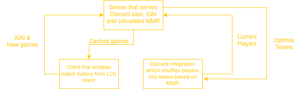

# custoMM

  

  
## What is this?
This is a project inspired by a heavy loss while playing customs in league of legends. The idea is to create fair teams, without taking rank into account(cuz that's boring and we're antiestablishment 🗿♿🥶).

## Mechanism
  

CORRECTION, the client will be just a simple exe file that one runs once they want/finish a game. Lol.

## Registration
A user registers like so:
  1. Opens the client of custoMM
  2. Tells the designated bot that they want to register with their IGN(the bot assumes EUNE unless changed in the code) (e.g. !register leomesipicha)
  3. The client prompts the user if they really want to proceed, showing the discord username which initiated the registration. When a username is registered, it cannot be registered again(do not worry, even if you change your name in either LoL or Discord you will still be registered). You can still lend out your account, however, using the [guest mode](#guest-mode).
   
Here's a flowchart explaining the technical stuff about this process:  
  

## Guest mode
If you want to use somebody else's account while playing customs, you can temporarily claim it, which will make the actual owner not gain MMR from the current game. That's about it. You, as the temporary player, do receive some MMR, however it is reduced by 50%, bc god damn get your own account wtf.

